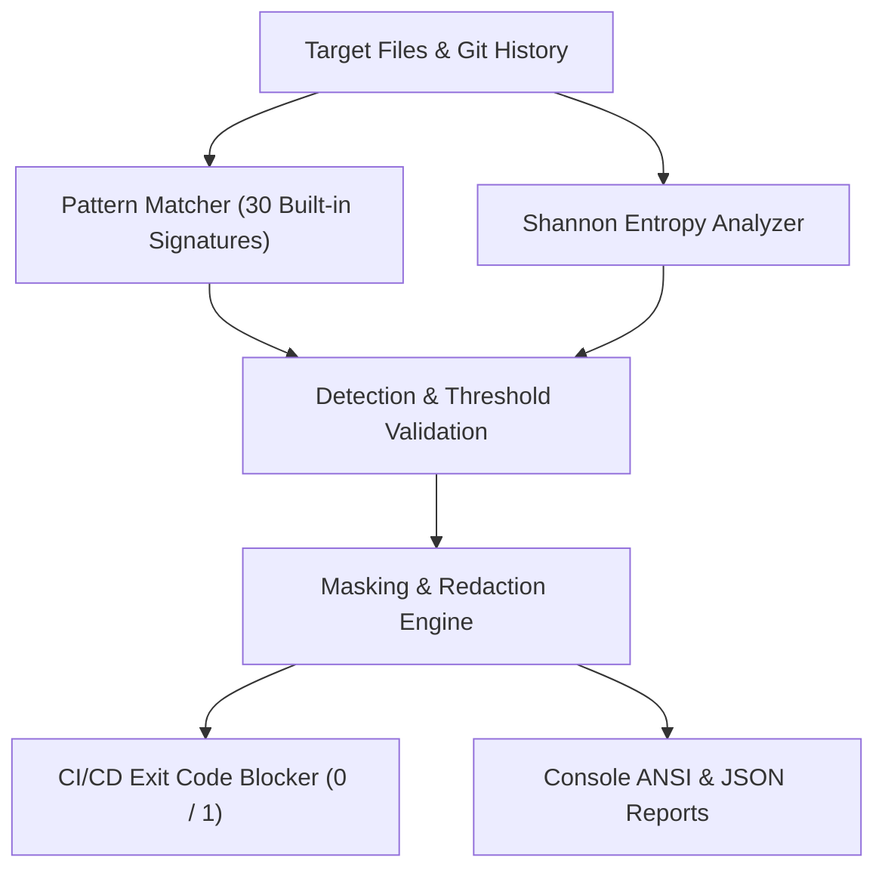

[🇸🇦 العربية](README.ar.md) | [🇬🇧 English](README.md)

# 🛡️ eidcloud-secret-hunter

> **Topics:** `eidcloud` `security-scanner` `secret-detection` `api-keys` `git-scanner` `devsecops` `php8`

[](https://github.com/shadialhasan/eidcloud-secret-hunter/releases)
[](https://www.php.net/)
[](LICENSE)
[](https://github.com/shadialhasan/eidcloud-secret-hunter/actions)
[](https://colab.research.google.com/github/shadialhasan/eidcloud-secret-hunter/blob/main/notebooks/quickstart.ipynb)

**eidcloud-secret-hunter** is an enterprise-grade, high-velocity secrets, tokens, and credential detection scanner for codebases and Git history. Built with **pure PHP 8.2+** and **zero external vendor dependencies**, it delivers microsecond scanning speeds, military-grade regex accuracy, Shannon entropy analysis, and intelligent credential redaction.

---

## 🏗️ Architecture & Pipeline



---

## ⚡ Core Capabilities

- **30 High-Precision Built-in Signatures**:
  - **AI / LLMs**: OpenAI (Project `sk-proj-`, Admin `sk-admin-`, Legacy `sk-`), Anthropic Claude (`sk-ant-api03-`).
  - **Cloud Providers**: AWS Access Key ID (`AKIA...`), AWS Secret Access Key, Google Cloud Platform API Key (`AIza...`), Google OAuth 2.0 User Token (`ya29...`).
  - **VCS & Developer Services**: GitHub Classic PAT (`ghp_`), Fine-Grained PAT (`github_pat_`), OAuth (`gho_`), App Tokens (`ghu_`/`ghs_`).
  - **Payment Gateways**: Stripe Secret Key (`sk_live_`), Stripe Restricted Key (`rk_live_`), Square Access Token (`sq0atp-`).
  - **Cryptography**: Unencrypted Private Keys (RSA, EC, OpenSSH, DSA, PGP).
  - **Databases & URIs**: Plaintext connection strings (`postgres://`, `mysql://`, `mongodb://`, `redis://`, etc.).
  - **Communication & Bots**: Slack User/Bot tokens (`xoxb-`/`xoxp-`), Slack Webhooks, Discord Bot Tokens & Webhooks, Telegram Bot Tokens, Twilio Account SIDs & API Keys, SendGrid Keys, Mailgun Keys.
  - **E-Commerce & Registries**: Shopify Tokens (`shpat_`), NPM Access Tokens (`npm_`), PyPI API Tokens (`pypi-AgEI...`), Cloudinary URIs.
  - **Generic High-Entropy Secrets**: Variable assignments to `api_key`, `secret`, `auth_token`, `client_secret` filtered by Shannon entropy.
- **Shannon Entropy Analysis**:
  - Implements statistical information entropy $H = -\sum p_i \log_2(p_i)$ to distinguish genuine high-randomness cryptographic secrets from dictionary words, minimizing false positives.
- **Smart Masking Engine**:
  - Preserves recognizable service prefixes and suffixes while redacting inner entropy (e.g., `sk-proj-****AbCd`, `ghp_****1234`), preventing terminal leaks and log pollution.
- **Git Commit History Diff Scanner**:
  - Inspects commit diffs across full Git history (`git-scan`), surfacing secrets that were committed and subsequently deleted in earlier commits.
- **CI/CD Blocker Automation**:
  - Returns exit code `1` when critical or high severity credentials are detected, instantly failing vulnerable pull requests and automated builds.
- **Zero Dependencies**:
  - 100% pure PHP 8.2+. Runs out of the box without requiring `composer install`.

---

## 🚀 Installation & Setup

### Requirements
- **PHP 8.2** or higher (CLI)
- **Git** (for commit history scanning)

### Standalone Installation
```bash
git clone https://github.com/shadialhasan/eidcloud-secret-hunter.git
cd eidcloud-secret-hunter
```

### Composer Integration
```bash
composer require eidcloud/secret-hunter --dev
```

---

## 💻 CLI Usage

The executable is located at `bin/eidcloud-secrets`.

### 1. Basic Working Tree Scan
```bash
# Scan current directory with secrets masked
php bin/eidcloud-secrets scan . --mask

# Scan specific folder
php bin/eidcloud-secrets scan ./src --mask
```

### 2. CI/CD Pipeline Scanning with Exit Blocker
```bash
# Fail build (exit code 1) if HIGH or CRITICAL secrets are detected
php bin/eidcloud-secrets scan . --fail-on=high --mask
```

### 3. Machine-Readable JSON Output
```bash
# Output JSON for SIEM, SonarQube, or dashboard pipelines
php bin/eidcloud-secrets scan . --json --min-severity=high
```

### 4. Git Commit History Scanner
```bash
# Scan previous 100 commits for historical or deleted secrets
php bin/eidcloud-secrets git-scan . --depth=100 --mask
```

### 5. Inspect Registered Signatures
```bash
php bin/eidcloud-secrets rules
```

---

## 🔧 PHP API Usage

You can embed the scanner directly into your PHP application or custom testing suite:

```php
<?php

require_once __DIR__ . '/vendor/autoload.php'; // or src/autoload.php

use EidCloud\SecretHunter\Scanner;
use EidCloud\SecretHunter\Report\ConsoleReporter;
use EidCloud\SecretHunter\Report\JsonReporter;

$scanner = new Scanner();

// 1. Scan a directory
$result = $scanner->scanDirectory(__DIR__ . '/project', [
    'minSeverity' => 'high',
    'mask'        => true,
]);

// 2. Scan an in-memory string
$findings = $scanner->scanString('$apiKey = "sk-proj-1234567890abcdef1234567890abcdef12345678";');

// 3. Render report
$reporter = new ConsoleReporter();
echo $reporter->render($result, mask: true);

if ($result->hasCriticalOrHigh()) {
    echo "Secrets detected!\n";
}
```

### Shannon Entropy Utility
```php
use EidCloud\SecretHunter\Entropy\ShannonEntropy;

$entropy = ShannonEntropy::calculate("sk-proj-7a8b9c0d1e2f3a4b5c6d"); // ~4.12
$isRandom = ShannonEntropy::isHighEntropy("some_random_key_value", threshold: 3.8);
```

---

## 🧪 Running Tests

The test suite runs with zero third-party dependencies:

```bash
php tests/run_tests.php
```

All 29 automated test cases will execute:
```text
╔════════════════════════════════════════════════════════════════════╗
║            🛡️  eidcloud-secret-hunter Automated Test Suite        ║
╚════════════════════════════════════════════════════════════════════╝
Running 29 tests on PHP 8.2.12...

  ✔ PASS  testRuleCount                              (1.05 ms)
  ✔ PASS  testOpenAiKeyDetection                     (16.55 ms)
  ✔ PASS  testAnthropicKeyDetection                  (0.27 ms)
  ✔ PASS  testAwsAccessKeyDetection                  (0.15 ms)
  ✔ PASS  testAwsSecretKeyDetection                  (0.17 ms)
  ✔ PASS  testGoogleApiKeyDetection                  (0.14 ms)
  ✔ PASS  testGitHubPatClassicDetection              (0.14 ms)
  ✔ PASS  testGitHubPatFineGrainedDetection          (0.16 ms)
  ✔ PASS  testJwtTokenDetection                      (0.22 ms)
  ✔ PASS  testStripeSecretKeyDetection               (0.13 ms)
  ✔ PASS  testPrivateSshKeyDetection                 (0.29 ms)
  ✔ PASS  testDatabaseUrlDetection                   (0.14 ms)
  ✔ PASS  testSlackTokenDetection                    (0.17 ms)
  ✔ PASS  testSlackWebhookDetection                  (0.15 ms)
  ✔ PASS  testTelegramBotTokenDetection              (0.14 ms)
  ✔ PASS  testSendGridKeyDetection                   (0.18 ms)
  ✔ PASS  testDiscordBotTokenDetection               (0.14 ms)
  ✔ PASS  testShopifyTokenDetection                  (0.14 ms)
  ✔ PASS  testSquareTokenDetection                   (0.13 ms)
  ✔ PASS  testMailgunKeyDetection                    (0.13 ms)
  ✔ PASS  testNpmTokenDetection                      (0.12 ms)
  ✔ PASS  testPyPiTokenDetection                     (0.15 ms)
  ✔ PASS  testCloudinaryDetection                    (0.13 ms)
  ✔ PASS  testGenericSecretAssignmentDetection       (0.13 ms)
  ✔ PASS  testShannonEntropyCalculation              (0.06 ms)
  ✔ PASS  testSecretMasking                          (0.02 ms)
  ✔ PASS  testInlineIgnoreDirective                  (0.01 ms)
  ✔ PASS  testSeverityFiltering                      (1.66 ms)
  ✔ PASS  testJsonReporterOutput                     (2.68 ms)

──────────────────────────────────────────────────────────────────────
TEST SUITE PASSED! All 29 tests executed successfully in 0.2692 seconds.
──────────────────────────────────────────────────────────────────────
```

---

## 👨‍💻 Author & Maintainer

- **Eng. MHD. Shadi AL-Hasan**
- **Location:** Damascus, Syria
- **Email:** [mhd.shadi.alhasan@gmail.com](mailto:mhd.shadi.alhasan@gmail.com)
- **Phone:** [+963934005922](tel:+963934005922)
- **GitHub:** [@shadialhasan](https://github.com/shadialhasan)

---

## 📄 License

This project is open-sourced software licensed under the [MIT License](LICENSE).

Copyright &copy; 2026 **MHD. Shadi AL-Hasan**. All rights reserved.

---

## 👤 Author & Maintainer

**Eng. MHD. Shadi AL-Hasan**  
- **Role:** Executive CTO & Enterprise Solutions Architect  
- **Email:** [mhd.shadi.alhasan@gmail.com](mailto:mhd.shadi.alhasan@gmail.com)  
- **Phone / WhatsApp:** [+963934005922](tel:+963934005922)  
- **Location:** Damascus, Syria  
- **GitHub:** [shadialhasan](https://github.com/shadialhasan)  

---

## 📄 License

This project is licensed under the MIT License - see the [LICENSE](LICENSE) file for details.  
Copyright (c) 2026 **MHD. Shadi AL-Hasan**. All rights reserved.
